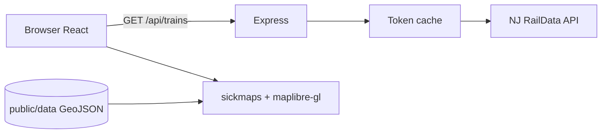

# iliketrains

Standalone NJ Transit **live rail map**: React + Express, with [steddy](https://www.npmjs.com/package/steddy), [@iantroisi/ui](https://www.npmjs.com/package/@iantroisi/ui), and [@iantroisi/sickmaps](https://www.npmjs.com/package/@iantroisi/sickmaps).

## Features

- Live vehicle positions via NJ Transit RailData (`getToken` + `getVehicleData`)
- Server-side credentials and token disk cache (respects ~10 `getToken` calls/day)
- MapLibre map with sickmaps **gta-v** theme and bundled NJ rail GeoJSON
- Troisi UI panel; steddy SWR polling every 20 seconds

## Architecture



## Run locally

```bash
npm install
cp .env.example .env.local
# Edit .env.local with RailData username/password
npm run dev
```

| Service | URL |
|---------|-----|
| Vite UI | http://localhost:5173 |
| API | http://localhost:8787 |

Production (single process):

```bash
npm run build
NODE_ENV=production npm start
```

Serves the built SPA and `/api/*` on `PORT` (default **8787**). Good fit for Railway, Render, or Fly.

## Environment

| Variable | Required | Description |
|----------|----------|-------------|
| `NJTRANSIT_USERNAME` | Yes | [NJ developer portal](https://developer.njtransit.com/) RailData user |
| `NJTRANSIT_PASSWORD` | Yes | RailData password |
| `PORT` | No | HTTP port (default 8787) |

Never commit `.env.local`. Token cache file `server/.raildata-token.json` is gitignored.

## License

MIT — follow NJ Transit API terms for live data.
